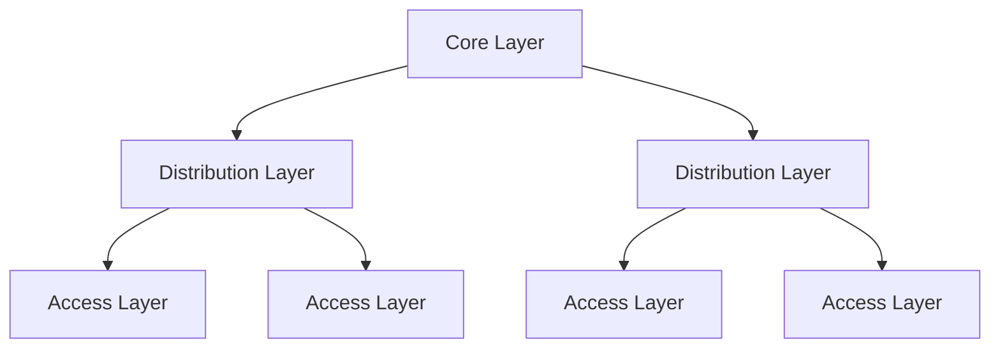

# Module 11 Reviewer: Network Design

## 1. Hierarchical Networks

### Borderless Switched Networks & Scalability

- **Borderless Network Architecture:** A Cisco framework that connects users anywhere, anytime, on any device securely, reliably, and seamlessly. Unifies wired and wireless access on a hierarchical, modular, resilient, and flexible infrastructure.
- **Scaling Requirements:** Evolving networks must scale to support converged network traffic (data, voice, video), critical applications, diverse business needs, and centralized management.

### Three-Tier vs. Two-Tier Hierarchical Frameworks

#### Three-Tier Campus Design

| Layer | Role |
|-------|------|
| **Access** | Interfaces directly with end devices (IP phones, PCs, access points) and provides initial access to the network. |
| **Distribution** | Aggregates access layer switches, limits Layer 2 broadcast domains, and implements routing, Quality of Service (QoS), and security policies. |
| **Core** | Acts as the high-speed network backbone connecting multiple distribution blocks; provides fast transport and fault isolation. Recommended to deploy using an extended-star physical topology. |

#### Two-Tier (Collapsed Core) Design

- Collapses the core and distribution layers into a single unified layer.
- Ideal for smaller campus locations or single-building sites where separate core and distribution layers are not cost-effective.

### Role of Switched Networks

- Modern LANs transition from flat hub networks to hierarchical switched LANs.
- Switches provide traffic management, enhanced security, QoS, and support for wireless, IP telephony, and mobility services.

---

## 2. Scalable Networks

### Strategies for Network Scalability

To allow a network to grow without losing availability and reliability, network designers utilize:

| Strategy | Description |
|----------|-------------|
| **Redundancy** | Prevents single points of failure by duplicating equipment, paths, and failover services. Spanning Tree Protocol (STP) must be enabled to eliminate logical Layer 2 loops. |
| **Failure Domains** | Limits the network area impacted by a device or link failure. Terminated at the distribution layer using pairs of routers/multilayer switches (building/departmental switch blocks). |
| **Bandwidth Expansion (Link Aggregation)** | Uses EtherChannel to combine multiple physical links into a single logical Port Channel interface. Offers load balancing and increased bandwidth. |
| **Access Layer Expansion (Wireless)** | Integrates Wireless LANs (WLANs) and access points (APs) for flexible, cost-effective connectivity. |
| **Scalable Routing Protocols** | Uses hierarchical link-state routing protocols like OSPF with areas to limit routing table size and restrict LSA updates. |

---

## 3. Switch Hardware

### Switch Platforms

| Platform | Example | Notes |
|----------|---------|-------|
| **Campus LAN Switches** | Cisco Catalyst 3850 / 9400 | Designed for high user density, speed, and security. |
| **Cloud-Managed Access Switches** | Cisco Meraki | Allows virtual stacking and remote web management. |
| **Data Center Switches** | Cisco Nexus series | Promotes infrastructure scalability and virtualization intelligence. |
| **Service Provider Switches** | — | Features application intelligence, integrated security, and simplified management. |

### Form Factors

| Form Factor | Description |
|-------------|-------------|
| **Fixed Configuration** | Features and port densities are fixed upon purchase and cannot be expanded. |
| **Modular Configuration** | Accepts field-replaceable line cards in a chassis for customizable port density and expansion. |
| **Stackable Switches** | Connects multiple physical switches using special stacking cables to operate as a single logical switch. |
| **Rack Units (RU)** | Standard rack height unit measurement: 1 RU = 1.75 inches / 44.45 mm. |

### Key Performance Metrics & Features

- **Port Density:** Total number of ports available on a single switch (e.g., fixed switches offer 12, 24, 48 ports; modular Catalyst 9400 supports up to 384 ports).
- **Forwarding Rates:** Specifies data processing capabilities per second.
- **Wire Speed:** Full theoretical data rate attainable on each Ethernet port simultaneously (100 Mbps to 100 Gbps). Access layer switches do not always require full wire speed across all ports due to uplink limitations.
- **Power over Ethernet (PoE):** Delivers electrical power over standard twisted-pair Ethernet cables to endpoints (IP phones, APs, cameras).
- **Multilayer Switching:** Deployed at distribution/core layers; uses dedicated hardware like Application-Specific Integrated Circuits (ASICs) to forward IP packets at near Layer 2 speeds.
- **Business Considerations:** Cost, port density, power requirements (PoE & redundant PSUs), reliability, connection speeds, frame buffers, and scalability.

---

## 4. Router Hardware

### Router Roles & Requirements

- **Primary Purpose:** Uses IP address network prefixes to route packets toward remote destinations and select backup paths.
- **Key Functions:** Acts as default gateway, contains Layer 2 broadcasts, interconnects geographically separated sites, provides departmental security via Access Control Lists (ACLs), and logically groups users.

### Cisco Router Categories

| Category | Description | Examples |
|----------|-------------|----------|
| **Branch Routers** | Optimizes branch services on a single platform. | Cisco ISR 4000 Series |
| **Network Edge Routers** | Delivers high-performance, secure aggregation connecting campus, data center, and branch networks. | Cisco ASR 9000 / 1000 Series |
| **Service Provider Routers** | Scalable backbone routers providing subscriber-aware services. | Cisco NCS 6000 / 5500 Series |
| **Industrial Routers** | Compact, ruggedized platforms designed for extreme/harsh environmental conditions. | Cisco 1100 / 800 Industrial ISR Series |
| **Small Branch Routers** | Compact, fanless platforms integrating WAN, switching, and security for small/medium-sized businesses. | Cisco 900 Series |
