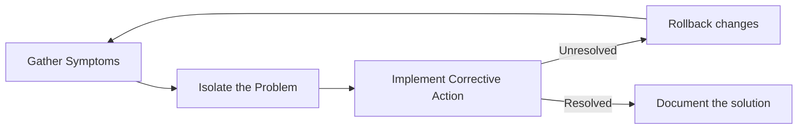

# Module 12 Reviewer: Network Troubleshooting

## 1. Network Documentation

### Network Topologies & Device Records

| Item | Description |
|------|-------------|
| **Physical Topology** | Shows the actual physical layout and location of hardware, including room numbers, rack positions, and interface cable connections. |
| **Logical Topology** | Illustrates the logical flow of data, including IP address schemes, subnets, VLAN assignments, switch trunks, routing protocols, and virtual connections. |
| **Device Records** | Must contain up-to-date hardware models, IOS software versions/licenses, memory configurations, interface IP/MAC address mappings, description notes, and connected neighbor devices. |

### Establishing a Network Baseline

**Purpose:** Measures normal network operation to define the network's standard behavior and highlight performance anomalies or bottlenecks.

| Step | Action | Details |
|------|--------|---------|
| 1 | **Select Data Types** | Focus on a few core parameters initially (e.g., interface utilization, CPU utilization) to avoid data overload. |
| 2 | **Identify Key Target Devices/Ports** | Focus on critical path elements like core/distribution interfaces, key server links, and gateway routers. |
| 3 | **Determine Duration** | Span at least **7 days**. Standard baselines last **2 to 4 weeks** (not exceeding 6 weeks unless measuring long-term trends). |

### Verification Commands for Documentation

| Command | Purpose |
|---------|---------|
| `show version` | Displays device uptime, hardware details, memory, and running IOS image file. |
| `show ip interface brief` / `show ipv6 interface brief` | Displays status and IP details for all interfaces. |
| `show interfaces` | Shows full interface metrics, error counters, line protocols, and utilization statistics. |
| `show ip route` / `show ipv6 route` | Displays active routing table entries. |
| `show cdp neighbors detail` | Displays connected Cisco neighbor details. |
| `show arp` / `show ipv6 neighbors` | Displays ARP cache (IPv4) or Neighbor Discovery cache (IPv6). |
| `show tech-support` | Gathers extensive diagnostic output across multiple `show` commands for technical support reporting. |

---

## 2. Troubleshooting Process

### Structured Troubleshooting Stages

#### General 3-Stage Method

#### Detailed 7-Step Method

1. **Define the Problem:** Verify and clearly outline the nature of the issue.
2. **Gather Information:** Collect diagnostic data from affected hosts and network hardware.
3. **Analyze Information:** Evaluate logs, baselines, topological data, and network behavior.
4. **Eliminate Possible Causes:** Systematically narrow down possible operational causes.
5. **Propose Hypothesis:** Formulate a targeted hypothesis for the root cause.
6. **Test Hypothesis:** Implement a controlled change with a planned rollback strategy to verify the fix.
7. **Solve & Document:** Finalize the solution, notify affected parties, and record entry details to aid future issues.

### Questioning End Users

Use open-ended questions to gather initial symptoms:

- What doesn't work?
- What changed?
- When did the issue start?
- Is it constant or intermittent?
- Can it be reproduced?

### Layered Model Troubleshooting Methods

| Method | Approach | Best For |
|--------|----------|----------|
| **Bottom-Up** | Starts at Layer 1 (Physical) and moves upward. | Suspected hardware or physical cabling problems. |
| **Top-Down** | Starts at Layer 7 (Application) and moves downward. | Simple or software/application-oriented issues. |
| **Divide-and-Conquer** | Starts at an intermediate layer (typically Layer 3) and tests in both directions based on results. | When the faulty layer is unclear. |
| **Follow-the-Path** | Traces the precise data flow path from source to destination. | Narrowing down fault locations. |
| **Substitution / Comparison** | Swaps a faulty device with a working unit, or compares settings against an operational system. | Isolating faulty hardware or misconfigurations. |

---

## 3. Troubleshooting Tools

### Software & Analytical Tools

- **Network Management Systems (NMS) & Knowledge Bases:** Provide device-level fault tracking, automation, and online vendor technical reference lookup.
- **Protocol Analyzers (e.g., Wireshark):** Capture, decode, and inspect packet headers and contents from Layer 1 through Layer 7.
- **Syslog Server:** Captures text-based notification messages over **UDP port 514** sent from managed network hosts.

### Hardware Troubleshooting Tools

| Tool | Function |
|------|----------|
| **Digital Multimeter** | Measures voltage, current, and resistance. |
| **Cable Tester** | Handheld device for checking connectivity, pinout mappings, and continuity on copper/fiber runs. |
| **Cable Analyzer** | Advanced tool used to certify, test, and measure performance characteristics on network media. |
| **Portable Network Analyzer** | Mobile unit for investigating traffic patterns, VLANs, and switched network health. |
| **Cisco Prime NAM** (Network Analysis Module) | Browser-based platform offering integrated packet, application, and traffic analysis. |

---

## 4. Symptoms and Causes of Network Problems

### Layer 1 (Physical Layer) Issues

- **Symptoms:** Performance dropping below baseline, complete connectivity loss, network bottlenecks, high CPU utilization, and hardware console error messages.
- **Common Causes:** Power failures, faulty/damaged cables, loose/oxidized connectors, attenuation (exceeding cable length specifications), local Electromagnetic Interference (EMI) noise, incorrect clock rates, and hardware/driver faults.

### Layer 2 (Data Link Layer) Issues

- **Symptoms:** Lack of Layer 3 connectivity, lower performance levels, excessive broadcast/multicast traffic, and interface line protocol error notifications.
- **Common Causes:** Encapsulation errors, address mapping issues (ARP), framing errors, duplex mismatches, and Spanning Tree Protocol (STP) failures or forwarding loops.

### Layer 3 (Network Layer) Issues

- **Symptoms:** Complete site network outages or suboptimal routing paths affecting a subset of subnets.
- **Common Causes:** Physical/power changes affecting links, incorrect or missing static/dynamic routes in the routing table, neighbor adjacency failures in OSPF/EIGRP, and corrupted link-state/topology databases.

### Transport Layer & Application Layer Issues

- **ACL Issues:** Incorrect interface direction (inbound vs. outbound), improper sequence order, implicit deny dropping wanted traffic, and misconfigured port/protocol criteria.
- **NAT Interoperability:** NAT can interfere with services that require specific un-translated ports or protocols (e.g., DHCP/BOOTP source IP `0.0.0.0`, external DNS resolution, embedded IP applications, IPsec encryption). Using helper features helps resolve issues.
- **Application Layer Protocols:**

| Protocol | Use |
|----------|-----|
| SSH / Telnet | Remote access |
| HTTP / HTTPS | Web traffic |
| FTP / TFTP | File transfer |
| SMTP / POP | Email |
| SNMP | Management |
| DNS | Name resolution |

---

## 5. Troubleshooting IP Connectivity

### Systematic Bottom-Up Connectivity Checklist

- [ ] **1. Check Physical Connectivity:** Verify media links and basic operational link status at the point of failure.
- [ ] **2. Check Duplex Mismatches:** Verify speed and duplex parameters across connected interfaces.
- [ ] **3. Verify Local Network Addressing:** Verify local IP configurations, netmasks, VLAN port assignments, and ARP cache entries (`arp -a`).
- [ ] **4. Verify Default Gateway Settings:** Confirm local hosts point to the proper gateway IP (`route print` / `show ip route`). Ensure IPv6 routers participate in the All-IPv6-Routers multicast group (`FF02::2`) via `ipv6 unicast-routing`.
- [ ] **5. Verify Correct Path / Longest Match:** Validate routing table entries to confirm traffic follows the expected hop-by-hop path using the longest matching prefix.
- [ ] **6. Verify Transport Layer Functionality:** Test Layer 4 end-to-end socket responsiveness using utilities like Telnet (e.g., `telnet [IP] [port]`).
- [ ] **7. Verify Access Control Lists (ACLs):** Confirm ACLs are placed on the correct interface and in the proper direction, ensuring valid traffic is not denied.
- [ ] **8. Verify DNS Configuration:** Verify domain resolution settings and host-to-IP lookup operation using `nslookup` or local host mapping tables.
